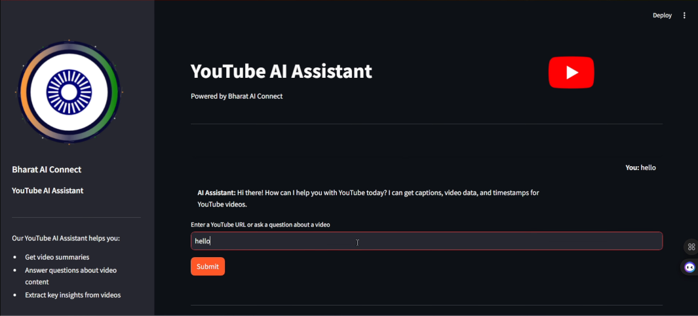

<div align="center">

# 🎬 Bharat AI Connect - YouTube Agent


[](https://www.python.org/)
[](https://streamlit.io/)
[](https://www.youtube.com/@Pawankumar-py4tk)
[](LICENSE)

</div>

---

## 🚀 **What is this?**

<div align="center">

</div>

**Bharat AI Connect YouTube Agent** is an intelligent AI-powered assistant that transforms how you interact with YouTube videos. Upload a video URL, and our AI will help you extract valuable insights, summaries, and answer any questions about the content!

<div align="center">

### 🎯 **Key Features**

| Feature | Description | Status |
|---------|-------------|--------|
| 📹 **Video Analysis** | Get comprehensive summaries of YouTube videos | ✅ |
| 🤖 **AI Q&A** | Ask questions about video content and get instant answers | ✅ |
| 🔍 **Insight Extraction** | Extract key insights and important information | ✅ |
| 🎨 **Beautiful UI** | Modern Streamlit interface with custom branding | ✅ |
| 💾 **Session Memory** | Remembers conversation history across sessions | ✅ |

</div>

---

## 🛠️ **Installation & Setup**

<details>
<summary>📦 Click to expand installation steps</summary>

### **Prerequisites**
- Python 3.8 or higher
- Git

### **Step 1: Clone the Repository**
```bash
git clone https://github.com/your-username/youtube-ai-agent.git
cd youtube-ai-agent
```

### **Step 2: Install Dependencies**
```bash
pip install -r requirements.txt
```

### **Step 3: Set up Environment**
Make sure you have your Google API key ready for Gemini AI.

</details>

---

## 🚀 **Quick Start**

<div align="center">

</div>

### **Launch the Application**
```bash
streamlit run streamlit_app.py
```

### **Open in Browser**
Navigate to `http://localhost:8501` and start exploring! 🌐

---

## 💡 **Usage Examples**

<div align="center">

### 🎬 **Analyze Videos**
```
"Analyze this YouTube video:  https://youtu.be/aE52l4KvdZU"
```

### ❓ **Ask Questions**
```
"What are the main points discussed in the video?"
"Who are the speakers mentioned in this content?"
"Can you summarize the key takeaways?"
```

### 🔍 **Get Insights**
```
"What's the most important lesson from this video?"
"List all the tools mentioned in the video"
```

</div>

---

## 🏗️ **Technology Stack**

<div align="center">

| Technology | Purpose | Badge |
|------------|---------|-------|
| **Agno AI** | AI Framework |  |
| **Google Gemini** | Language Model |  |
| **Streamlit** | Web Interface |  |
| **YouTube API** | Video Transcripts |  |
| **SQLite** | Session Storage |  |

</div>

---

## 🎨 **Screenshots**

<div align="center">

### **Main Interface**



</div>

---

## 🌟 **About Bharat AI Connect**

<div align="center">

</div>

**Transforming Bharat with Intelligent AI** 🇮🇳

We are on a mission to empower Indian enterprises with cutting-edge AI solutions that drive innovation and efficiency across organizations.

<div align="center">

[](https://bharataiconnect.com/)
[](https://www.youtube.com/@Pawankumar-py4tk)


</div>

---

## 🤝 **Contributing**

<div align="center">

</div>

We welcome contributions! Please feel free to submit a Pull Request. For major changes, please open an issue first to discuss what you would like to change.

---

## 📝 **License**

This project is proprietary and belongs to **Pawan Kumar**. All rights reserved.

---

<div align="center">

### **⭐ Star this repository if you found it helpful!**


**Made with ❤️ by Pawan Kumar**

</div>
